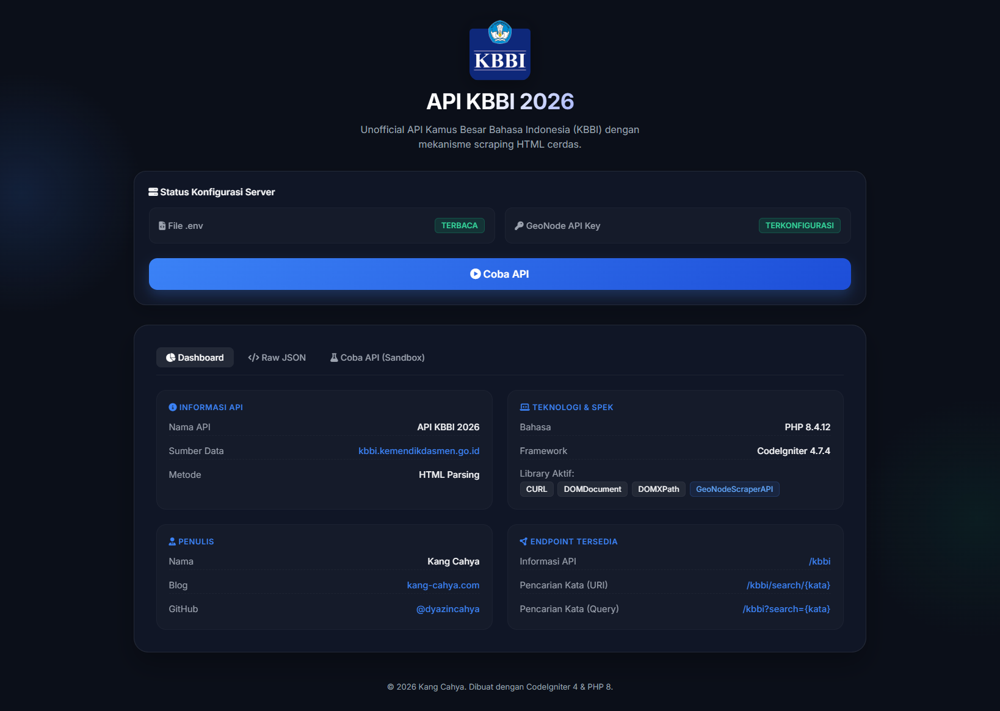
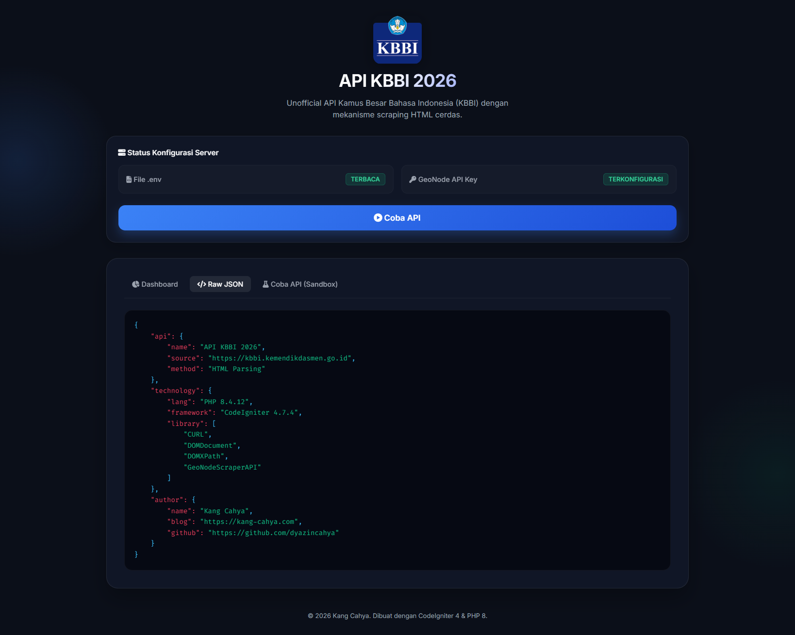
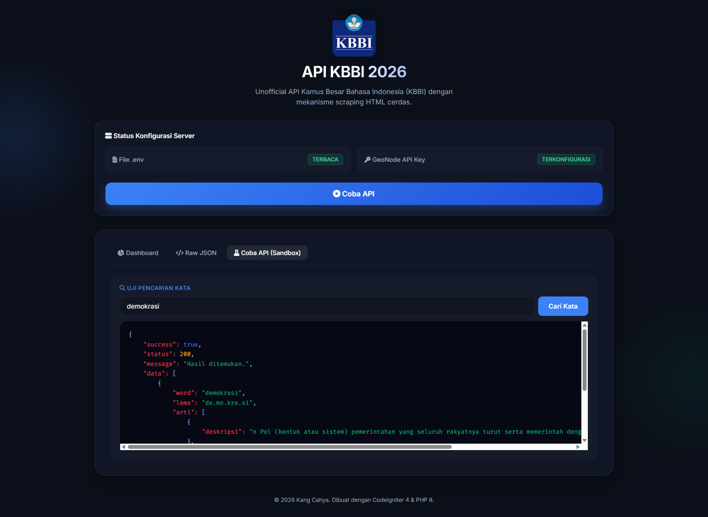
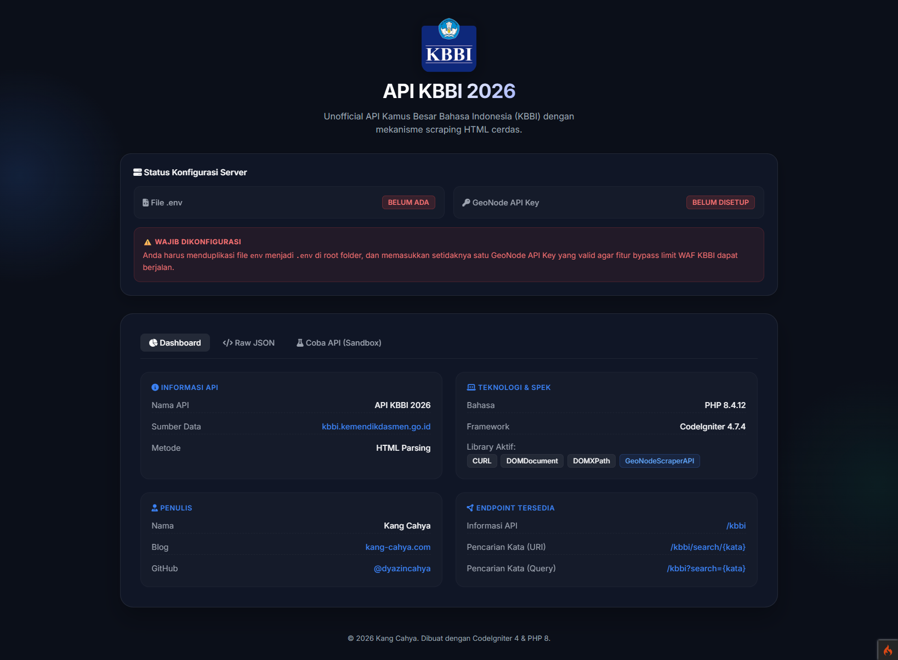
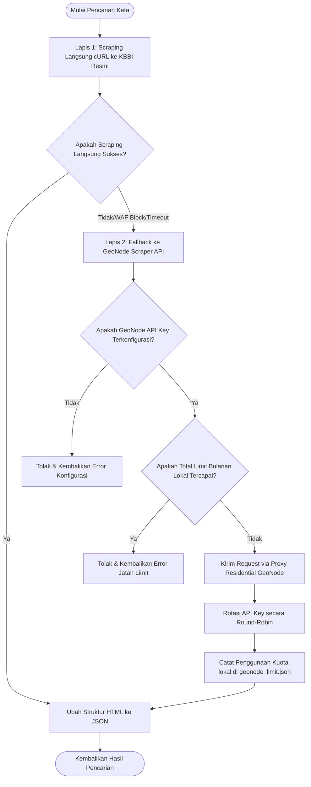

<div align="center">
  
  <h1>Unofficial API Kamus Besar Bahasa Indonesia (KBBI) 2026</h1>
  <p><em>API pencarian makna kata dan peribahasa KBBI berbasis penapisan HTML menggunakan CodeIgniter 4 dan PHP 8.</em></p>
  
  <p>
    
    
    
  </p>
</div>

---

## Tangkapan Layar (Screenshots)

Berikut adalah beberapa tampilan dasbor dari API KBBI 2026:

<details>
<summary><b>Klik untuk melihat tangkapan layar</b></summary>
<br>

### 1. Dasbor Utama (Informasi Teknologi dan Spesifikasi)

Halaman utama yang menampilkan status server, spesifikasi sistem, data penulis, dan daftar endpoint yang tersedia.

<br>



<br><br><br>

### 2. Tampilan JSON View (Raw JSON)

Tampilan data visualisasi spesifikasi sistem dan konfigurasi API dalam representasi JSON interaktif.

<br>



<br><br><br>

### 3. Uji Coba API (Sandbox Tab)

Fitur sandbox untuk menguji pencarian kata secara langsung dari halaman utama.

<br>



<br><br><br>

### 4. Peringatan Validasi Konfigurasi Server (.env dan GeoNode Key)

Notifikasi yang otomatis muncul jika berkas konfigurasi `.env` atau GeoNode API Key belum dikonfigurasi dengan benar di server.

<br>



<br>

</details>

---

## Alur Kerja Pengambilan Data (Scraping Workflow)

Untuk menjaga performa dan efisiensi kuota, API ini menggunakan alur kerja multi-lapis saat mencari sebuah kata:



1. **Lapis 1 - Scraping Langsung (Direct Request):** Sistem mencoba melakukan koneksi cURL langsung ke situs resmi KBBI. Proses ini bersifat gratis dan tanpa batasan (sangat cocok untuk localhost).
2. **Lapis 2 - Fallback GeoNode Scraper API (Automated):** Jika koneksi langsung di atas gagal atau mengalami waktu habis (terutama saat dideploy di server VPS yang diblokir oleh WAF KBBI), sistem akan otomatis mengalihkan permintaan menggunakan **GeoNode Scraper API** melalui Proxy Residensial.
3. **Rotasi Multi-Akun dan Jatah Kuota Lokal:** Mendukung penggunaan lebih dari 1 GeoNode API Key secara bergantian (round-robin) dan dilengkapi dengan pencatat batas kuota bulanan lokal otomatis (`writable/geonode_limit.json`) berdasarkan tanggal pembaruan masing-masing akun agar kuota gratis Anda tidak terlampaui.

---

## Panduan Konfigurasi Proyek secara Detail

Ikuti langkah-langkah di bawah ini untuk memasang dan menjalankan API KBBI ini pada mesin lokal Anda:

### Prasyarat Sistem

- PHP versi **8.1** atau yang lebih baru (Disarankan PHP 8.2 / 8.3 / 8.4 / 8.5)
- Ekstensi PHP diaktifkan: `curl`, `dom`, `xml`
- [Composer](https://getcomposer.org/) terinstal pada komputer Anda
- Server Lokal (Disarankan menggunakan **Laragon**, **XAMPP**, atau **WAMP** untuk mempermudah pengaturan lingkungan lokal PHP)

### Langkah-langkah Instalasi

#### 1. Klon Repositori

Unduh kode sumber proyek ini ke komputer lokal Anda:

```bash
git clone https://github.com/dyazincahya/API-KBBI-PHP-Codeigniter-4.git
cd API-KBBI-PHP-Codeigniter-4
```

#### 2. Instal Dependensi (Composer)

Jalankan perintah berikut untuk mengunduh semua pustaka dependensi framework CodeIgniter 4:

```bash
composer install
```

#### 3. Konfigurasi Berkas Lingkungan (.env)

Salin berkas konfigurasi bawaan `env` menjadi `.env`:

```bash
cp env .env
```

_(Di Windows PowerShell, gunakan perintah: `copy env .env`)_

#### 4. Pengaturan GeoNode API Key (Wajib untuk Server/Hosting)

Jika Anda menerapkan API ini ke hosting/VPS, IP server Anda kemungkinan besar akan diblokir oleh WAF resmi KBBI. Anda wajib menyiapkannya dengan cara:

1. Daftar akun gratis di **[GeoNode Scraper API](https://app.geonode.com/scraper-api)**.
2. Selesaikan verifikasi email dan salin **API Key** dari dasbor Anda.
3. Buka berkas `.env` hasil salinan tadi menggunakan penyunting teks, lalu konfigurasikan kunci Anda di bagian bawah:
   ```env
   geonode.apiKeys.0.name = 'Akun Utama Anda'
   geonode.apiKeys.0.apikey = 'MASUKKAN_API_KEY_ANDA_DI_SINI'
   geonode.apiKeys.0.limit = 1499
   geonode.apiKeys.0.reset_day = 10
   ```
   _Anda dapat memasukkan lebih dari satu akun/kunci untuk dirotasi secara bergantian oleh sistem._
    
   _Catatan: Setiap akun GeoNode Scraper API memiliki batasan (limit) gratis sebesar 1.500 permintaan per bulan, yang akan diperbarui secara otomatis (reset) setiap bulannya berdasarkan tanggal pendaftaran masing-masing akun._

#### 5. Jalankan Server Lokal

Nyalakan server pengembangan CodeIgniter menggunakan Spark:

```bash
php spark serve
```

Setelah aktif, buka peramban Anda dan akses halaman utama di:
[http://localhost:8080/](http://localhost:8080/)

---

## API Endpoints dan Contoh Penggunaan

API ini menyediakan beberapa endpoint fleksibel untuk mencari definisi kata atau frasa:

### 1. Informasi API Utama

Mengembalikan deskripsi metadata dasar sistem.

- **URL:** `/kbbi`
- **Metode:** `GET`
- **Contoh Respons:**
  ```json
  {
    "api": {
      "name": "API KBBI 2026",
      "source": "https://kbbi.kemendikdasmen.go.id",
      "method": "HTML Parsing"
    },
    "technology": {
      "lang": "PHP 8.4.12",
      "framework": "CodeIgniter 4.7.4"
    }
  }
  ```

### 2. Pencarian Kata (Format URI)

Mencari definisi kata spesifik berdasarkan segmentasi URI.

- **URL:** `/kbbi/search/{kata_kunci}` (Contoh: `/kbbi/search/demokrasi`)
- **Metode:** `GET`

### 3. Pencarian Kata (Format Query Parameter)

Mencari definisi kata spesifik menggunakan parameter query string.

- **URL:** `/kbbi?search={kata_kunci}` (Contoh: `/kbbi?search=demokrasi`)
- **Metode:** `GET`

### Contoh Respons Hasil Pencarian (`/kbbi/search/demokrasi`):

```json
{
  "success": true,
  "status": 200,
  "message": "Hasil ditemukan.",
  "data": [
    {
      "word": "demokrasi",
      "lema": "de.mo.kra.si",
      "arti": [
        {
          "deskripsi": "n Pol (bentuk atau sistem) pemerintahan yang seluruh rakyatnya turut serta memerintah dengan perantaraan wakilnya; pemerintahan rakyat"
        },
        {
          "deskripsi": "n Pol gagasan atau pandangan hidup yang mengutamakan persamaan hak dan kewajiban serta perlakuan yang sama bagi semua warga negara"
        }
      ],
      "tesaurusLink": "https://tesaurus.kemendikdasmen.go.id/tematis/lema/demokrasi"
    }
  ]
}
```

---

## Optimasi Server Hosting

Agar performa scraping dan request fallback berjalan lancar di server hosting/cPanel Anda, silakan terapkan penyesuaian parameter PHP berikut:

1. `memory_limit`: Ubah ke nilai yang lebih besar (minimal `256M` atau `512M`).
2. `max_execution_time`: Atur ke nilai yang lebih tinggi (minimal `120` detik) untuk menangani waktu tunggu fallback scraper.
3. **OPcache**: Aktifkan OPcache di menu PHP Selector hosting Anda untuk mempercepat eksekusi framework CI4.
4. **Ekstensi PHP**: Pastikan ekstensi `dom`, `xml`, dan `curl` telah diaktifkan.

---

## Alternatif dan Repositori Terkait

- **[KBBI-Go (Versi Bahasa GO)](https://github.com/dyazincahya/kbbi-go)** - API KBBI dengan performa tinggi yang ditulis menggunakan bahasa Go.
- **[KBBI-SQL-Database](https://github.com/dyazincahya/KBBI-SQL-database)** - Jika Anda tidak ingin menggunakan API, Anda dapat mengunduh basis data SQL KBBI lengkap dalam format MySQL, SQLite, PostgreSQL, CSV, JSON, atau XML.
- **[MyKBBI Android App](https://play.google.com/store/apps/details?id=com.kang.cahya.apps.mykbbi)** - Aplikasi Kamus Bahasa Indonesia resmi buatan Kang Cahya di Google Play Store.

---

## Lisensi dan Penulis

- Proyek ini dilisensikan di bawah lisensi **MIT License**.
- Dibuat dan dikembangkan oleh **[Kang Cahya](https://kang-cahya.com)**.
